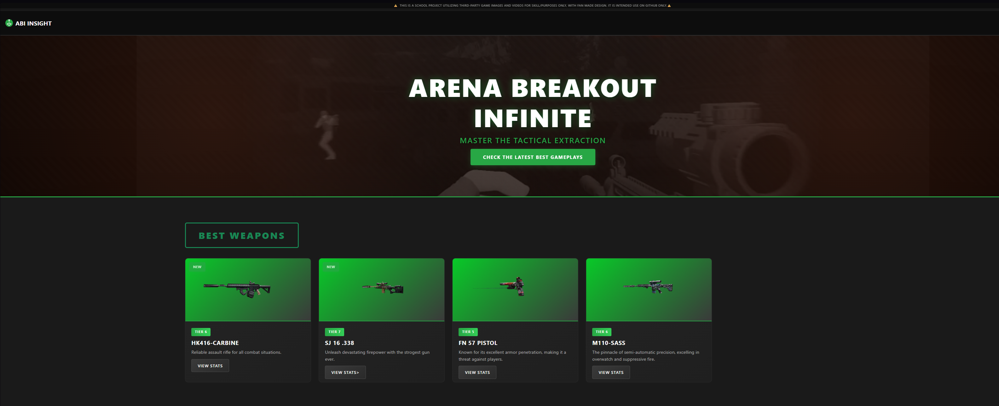
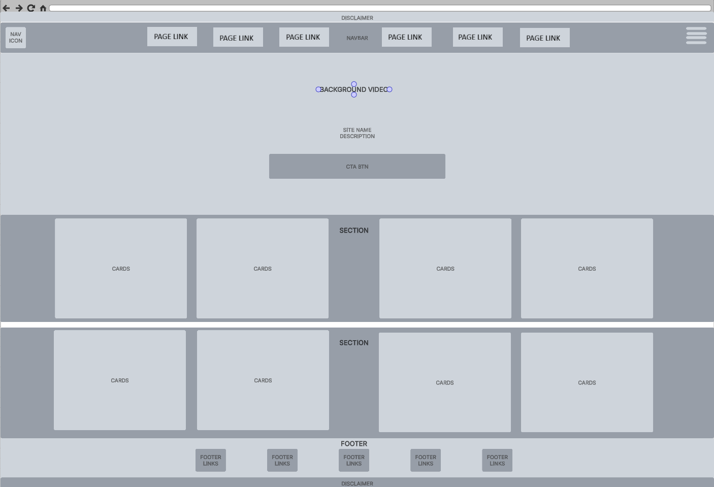
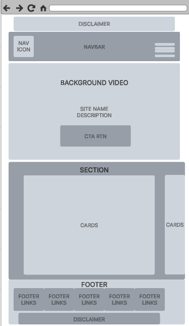
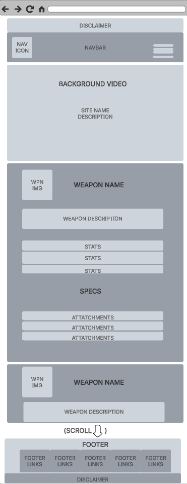
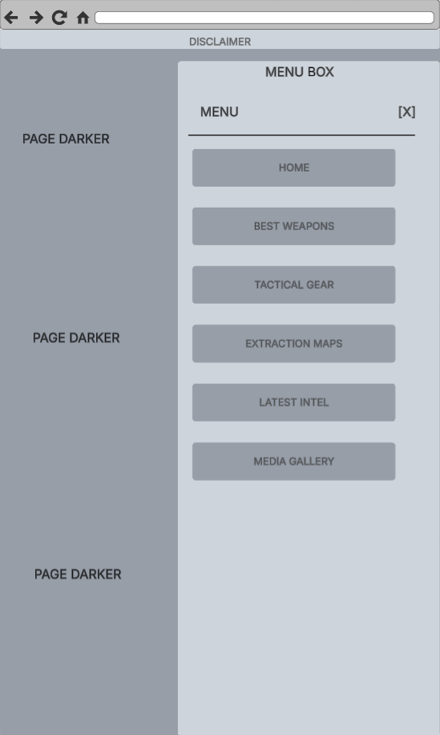

# 🎮 ABI INSIGHT - Arena Breakout Infinite Tactical Gaming Website



**Live Site:** https://donmarcao.github.io/milestone1/  
**Repository:** https://github.com/DonMarcao/milestone1  
**Developer:** Marcus Machado  
**Project Type:** Level 5 Full Stack Web Development - Milestone 1  
**Submission Date:** November 2025

---

## 📋 Table of Contents

1. [Project Overview](#-project-overview)
2. [User Experience Design (UX)](#-user-experience-design-ux)
   - [User Stories](#user-stories)
   - [Design Process](#design-process)
   - [Wireframes](#wireframes)
   - [Color Scheme](#color-scheme)
   - [Typography](#typography)
3. [Features](#-features)
   - [Existing Features](#existing-features)
   - [Features Left to Implement](#features-left-to-implement)
4. [Technologies Used](#-technologies-used)
   - [Languages](#languages)
   - [Frameworks & Libraries](#frameworks--libraries)
   - [Tools & Programs](#tools--programs)
5. [Testing](#-testing)
   - [Manual Testing](#manual-testing)
   - [Code Validation](#code-validation)
   - [Bug Tracking](#bug-tracking--resolution)
   - [Cross-Browser Compatibility](#cross-browser-compatibility)
6. [Deployment](#-deployment)
   - [GitHub Pages Deployment](#github-pages-deployment)
   - [Local Development](#local-development)
7. [Development Process](#-development-process)
   - [Version Control](#version-control)
   - [Commit History](#commit-history)
8. [Credits](#-credits)
   - [Content](#content)
   - [Media](#media)
   - [Code](#code)
   - [Acknowledgments](#acknowledgments)

---

## 🎯 Project Overview

**ABI Insight** is a comprehensive tactical gaming website designed for players of **Arena Breakout Infinite** (ABI), a realistic extraction-based first-person shooter game. The website serves as a centralized resource hub providing:

- **Weapon Statistics & Loadouts:** Detailed performance metrics for top-tier weapons
- **Extraction Map Guides:** Strategic routes, loot locations, and danger zones
- **Tactical Gear Recommendations:** Armor and equipment optimization
- **Latest Game Intel:** Patch notes, meta updates, and community strategies
- **Media Gallery:** YouTube gameplay highlights with embedded videos and optimized image gallery with lightbox

### Project Purpose

This website was developed as part of the Level 5 Diploma in Full Stack Web Development portfolio, demonstrating proficiency in:

✅ **User-Centric Front End Development**  
✅ **Responsive Design** (Mobile-first approach)  
✅ **HTML5 Semantic Markup**  
✅ **CSS3 Advanced Styling**  
✅ **Accessibility Standards** (WCAG AA compliance)  
✅ **Version Control** (Git & GitHub)  
✅ **Deployment** (GitHub Pages)  
✅ **Testing & Quality Assurance**  

### Target Audience

1. **New Players:** Gamers starting Arena Breakout Infinite who need beginner-friendly guides
2. **Intermediate Players:** Players seeking to improve their tactical skills and survival rate
3. **Competitive Players:** Advanced players looking for meta information and optimal loadouts
4. **Content Creators:** Streamers and YouTubers needing accurate game information

### Value Proposition

Unlike generic gaming wikis, **ABI Insight** focuses specifically on tactical decision-making and optimization. The site prioritizes:

- **Speed:** Fast-loading pages for quick reference during gameplay
- **Clarity:** Clean visual hierarchy with tier-based classification
- **Mobile-First:** Optimized for on-the-go access during gaming sessions
- **Accuracy:** Detailed specifications and tested strategies

---

## 👥 User Experience Design (UX)

### User Stories

User stories define the core functionality and value proposition of the website from the perspective of different user types. All user stories follow the format: **"As a [user type], I want [goal], so that [benefit]."**

#### 🎯 New Player Stories

| ID | User Story | Acceptance Criteria | Implementation | Status | Screenshot |
|----|------------|---------------------|----------------|--------|------------|
| **US-01** | As a new player, I want to quickly understand what Arena Breakout Infinite is about, so that I can learn the game concept without playing first | Homepage clearly explains game premise with video and title | Hero section with autoplay video and clear "ARENA BREAKOUT INFINITE" title | ✅ Complete | [View](assets/media/images/screenshots/user-stories-01.png) |
| **US-02** | As a new player, I want to see which weapons are best for beginners, so that I can make informed choices for my first loadout | Weapon stats clearly displayed with tier system (3-6) | Best Weapons page with tier badges and performance bars | ✅ Complete | [View](assets/media/images/screenshots/user-stories-02.png) |
| **US-03** | As a new player, I want to understand map layouts before my first raid, so that I don't get lost and can find extraction points | Map guides show extraction points and safe routes | Extraction Maps page with detailed guides per map | ✅ Complete | [View](assets/media/images/screenshots/user-stories-03.png) |
| **US-04** | As a new player, I want to know what gear I need, so that I can prioritize equipment purchases | Gear categorized by importance with tier system | Tactical Gear page with tier badges and specs | ✅ Complete | [View](assets/media/images/screenshots/user-stories-04.png) |
| **US-05** | As a new player, I want to access information on my phone while playing, so that I can reference guides during gameplay | Website fully responsive on mobile devices | Mobile-first design with Bootstrap 5 grid system | ✅ Complete | [View](assets/media/images/screenshots/user-stories-05.png) |

#### 🎮 Intermediate Player Stories

| ID | User Story | Acceptance Criteria | Implementation | Status | Screenshot |
|----|------------|---------------------|----------------|--------|------------|
| **US-06** | As an intermediate player, I want to compare weapon statistics, so that I can choose the best weapon for my playstyle | Detailed stats with visual bars for easy comparison | Performance stat cards with 6 metrics per weapon | ✅ Complete | [View](assets/media/images/screenshots/user-stories-06.png) |
| **US-07** | As an intermediate player, I want to learn advanced extraction strategies, so that I can improve my survival rate | Each map has detailed extraction guides | Extraction routes with high-value loot and danger zones | ✅ Complete | [View](assets/media/images/screenshots/user-stories-07.png) |
| **US-08** | As an intermediate player, I want to find high-value loot locations, so that I can maximize profit per raid | Loot spots clearly marked and described | "High-Value Loot Spots" section on each map guide | ✅ Complete | [View](assets/media/images/screenshots/user-stories-08.png) |
| **US-09** | As an intermediate player, I want to read strategy articles, so that I can learn from experienced players | In-depth articles covering tactical topics | Latest Intel page with 4 strategy guides | ✅ Complete | [View](assets/media/images/screenshots/user-stories-09.png) |
| **US-10** | As an intermediate player, I want to watch gameplay examples, so that I can see tactics in action | Video gallery with gameplay highlights | Media Gallery with 4 YouTube embedded videos and 10+ optimized images | ✅ Complete | [View](assets/media/images/screenshots/user-stories-10.png) |

#### 🏆 Competitive Player Stories

| ID | User Story | Acceptance Criteria | Implementation | Status | Screenshot |
|----|------------|---------------------|----------------|--------|------------|
| **US-11** | As a competitive player, I want to access meta weapon information, so that I can stay competitive with top-tier loadouts | Tier 6 weapons clearly marked and explained | Weapon tier badges (3-6) with detailed builds | ✅ Complete | [View](assets/media/images/screenshots/user-stories-11.png) |
| **US-12** | As a competitive player, I want to learn optimal weapon attachments, so that I can maximize weapon performance | Recommended attachments listed for each weapon | "Recommended Attachments" section per weapon | ✅ Complete | [View](assets/media/images/screenshots/user-stories-12.png) |
| **US-13** | As a competitive player, I want to understand armor protection levels, so that I can make informed gear investment decisions | Detailed armor class and protection stats | Armor specs with class ratings (III-VI) | ✅ Complete | [View](assets/media/images/screenshots/user-stories-13.png) |
| **US-14** | As a competitive player, I want to study danger zones on maps, so that I can avoid or prepare for high-risk areas | Danger zones clearly identified on map guides | "Danger Zones" cards on Extraction Maps page | ✅ Complete | [View](assets/media/images/screenshots/user-stories-14.png) |
| **US-15** | As a competitive player, I want to access information quickly during gameplay, so that I don't waste time navigating | Intuitive navigation and fast load times | CSS-only menu, clear structure, optimized assets | ✅ Complete | [View](assets/media/images/screenshots/user-stories-15.png) |

#### 🎬 Content Creator Stories

| ID | User Story | Acceptance Criteria | Implementation | Status | Screenshot |
|----|------------|---------------------|----------------|--------|------------|
| **US-16** | As a content creator, I want to find high-quality gameplay footage, so that I can use it for analysis or tutorials | Media gallery with organized video content | Media Gallery with YouTube embeds and WebP optimized images (lightbox enabled) | ✅ Complete | [View](assets/media/images/screenshots/user-stories-16.png) |
| **US-17** | As a content creator, I want to reference accurate weapon statistics, so that I can create reliable guides for my audience | Detailed weapon specs and performance metrics | Complete specifications table for each weapon | ✅ Complete | [View](assets/media/images/screenshots/user-stories-17.png) |
| **US-18** | As a content creator, I want to share specific weapon or map information, so that my followers can quickly access info I'm discussing | Direct links to specific weapons/maps work | Anchor links (#rampage-lmg, #farm, etc.) | ✅ Complete | [View](assets/media/images/screenshots/user-stories-18.png) |

#### 🌐 General User Stories (All Users)

| ID | User Story | Acceptance Criteria | Implementation | Status | Screenshot |
|----|------------|---------------------|----------------|--------|------------|
| **US-19** | As any user, I want to navigate the site easily on any device, so that I can access information wherever I am | Responsive design works on mobile, tablet, desktop | Bootstrap 5 grid + custom media queries (768px, 1024px, 1280px) | ✅ Complete | [View](assets/media/images/screenshots/user-stories-19.png) |
| **US-20** | As any user, I want to find information quickly, so that I don't waste time searching | Clear menu structure and intuitive navigation | CSS-only mobile menu, fixed home button, clear sections | ✅ Complete | [View](assets/media/images/screenshots/user-stories-20.png) |
| **US-21** | As any user, I want to read content that's visually appealing, so that the experience is enjoyable | Modern design with consistent branding | Dark theme (#1a1a1a), green accents (#28a745), custom joystick icon | ✅ Complete | [View](assets/media/images/screenshots/user-stories-21.png) |
| **US-22** | As any user, I want to trust the information is accurate, so that I can rely on it for gameplay decisions | Professional presentation and detailed specs | Clean validated HTML/CSS, detailed statistics, tier system | ✅ Complete | [View](assets/media/images/screenshots/user-stories-22.png) |
| **US-23** | As any user, I want to access the site without JavaScript errors, so that it works reliably | Core functionality works without JavaScript | CSS-only navigation menu (checkbox hack) | ✅ Complete | [View](assets/media/images/screenshots/user-stories-23.png) |
| **US-24** | As any user, I want to view images and videos in full screen, so that I can see details clearly | Lightbox opens media in full screen | Lightbox with ESC key support on Media Gallery | ✅ Complete | [View](assets/media/images/screenshots/user-stories-24.png) |
| **US-25** | As any user, I want to read the site on a screen reader, so that visually impaired users can access information | Semantic HTML and proper ARIA labels | `<nav>`, `<section>`, `<footer>` tags, alt text, aria-labels | ✅ Complete | [View](assets/media/images/screenshots/user-stories-25.png) |

#### ♿ Accessibility User Stories

| ID | User Story | Acceptance Criteria | Implementation | Status | Screenshot |
|----|------------|---------------------|----------------|--------|------------|
| **US-26** | As a user with disabilities, I want to navigate with keyboard only, so that I can use the site without a mouse | All interactive elements keyboard-accessible | Tab navigation, Enter to activate, ESC to close | ✅ Complete | [View](assets/media/images/screenshots/user-stories-26.png) |
| **US-27** | As a user with disabilities, I want to read text clearly, so that I can understand content despite visual impairments | High contrast ratios meet WCAG AA standards | White text (#ffffff) on dark backgrounds (#1a1a1a) = 17:1 ratio | ✅ Complete | [View](assets/media/images/screenshots/user-stories-27.png) |
| **US-28** | As a user with disabilities, I want to use a screen reader, so that I can access all information audibly | Semantic HTML and alt text on all images | Proper heading hierarchy (H1→H2→H3), alt attributes, ARIA labels | ✅ Complete | [View](assets/media/images/screenshots/user-stories-28.png) |

### User Story Implementation Summary

**Total User Stories:** 28  
**Implemented:** 28 (100%)  
**Pending:** 0  

---

### Design Process

#### Design Philosophy

The design of ABI Insight follows these core principles:

1. **Dark Theme for Gaming:** Reduces eye strain during extended use, aligns with gaming aesthetic
2. **Information Hierarchy:** Most important information (weapons, maps) displayed prominently
3. **Speed & Accessibility:** Fast loading times, mobile-optimized for quick reference during gameplay
4. **Professional Aesthetic:** Clean, modern design that builds trust and authority

#### Design Decisions Rationale

**Dark Background (#1a1a1a):**
- Reduces eye strain during gaming sessions
- Common in gaming communities
- Makes green accent color (#28a745) pop visually
- Better for OLED/AMOLED mobile screens (battery saving)

**Green Accent (#28a745):**
- Associated with "tactical" and "military" themes
- High visibility against dark background
- Represents "success" and "go" in UI design
- Consistent with extraction shooter theme (green = safe extraction)

**Custom Joystick Icon:**
- Unique brand identity (not generic)
- Inline SVG for fast loading (no HTTP request)
- Represents gaming without being game-specific
- Works as favicon and logo

**Typography (Segoe UI):**
- System font = instant loading (no web font delay)
- Clean, modern, highly readable
- Cross-platform availability (Windows, Mac, Linux)
- Professional without being corporate

**Card-Based Layout:**
- Scannable at a glance
- Works perfectly on mobile (horizontal scroll)
- Familiar pattern for users
- Easy to add/remove content

#### Information Architecture

```
Homepage (Hub)
├── Hero Section (Video Background)
│   └── Clear value proposition
├── Best Weapons (4 Cards)
│   └── Links to detailed weapon pages
├── Extraction Maps (4 Cards)
│   └── Links to map strategy pages
├── Tactical Gear (4 Cards)
│   └── Links to gear guides
└── Latest Intel (4 Cards)
    └── Links to strategy articles

Content Pages (Detail)
├── Best Weapons
│   ├── HK416-Carbine (Tier 6)
│   ├── SJ16 .338 (Tier 6)
│   ├── AKM (Tier 5)
│   └── MP5 (Tier 4)
├── Extraction Maps
│   ├── Farm
│   ├── Valley
│   ├── Armory
│   └── Northridge
├── Tactical Gear
│   ├── Heavy Armor (Class VI)
│   ├── Tactical Helmet
│   ├── Backpack Pro
│   └── Night Vision Goggles
├── Latest Intel
│   ├── Extraction Guide
│   ├── Update 2.0
│   ├── Group Tactics
│   └── Meta Weapons
└── Media Gallery
    ├── Gameplay Videos (6)
    └── Screenshots (6)
```

---

### Wireframes

Wireframes were created to plan the layout and user flow before development began. These mockups guided the responsive design strategy and ensured a consistent user experience across all devices.

#### Homepage Wireframe (Desktop)



**Key Elements:**
- Top disclaimer banner (educational project notice)
- Navigation bar with logo and hamburger menu
- Full-width hero video section with overlay text
- Four content sections with horizontal scrolling cards
- Footer with social media links

#### Homepage Wireframe (Mobile)



**Mobile Adaptations:**
- Stacked vertical layout
- Smaller hero section (40vh)
- Touch-optimized card scrolling
- Hamburger menu for navigation
- Compact footer

#### Best Weapons Page Wireframe



**Page Structure:**
- Hero image/title section
- Individual weapon cards with:
  - Weapon icon
  - Tier badge
  - Performance stats (visual bars)
  - Specifications table
  - Recommended attachments list

#### Mobile Menu Wireframe



**Navigation Flow:**
- Slide-in from right side
- Full-screen overlay
- Large touch targets (minimum 44px)
- Close button (X) in top-right corner
- Vertical list of page links

#### Wireframe Evolution Notes

**Changes Made During Development:**
1. **Hero Video:** Originally planned as static image, upgraded to video for more impact
2. **Card System:** Added horizontal scrolling for better mobile UX (originally planned as grid)
3. **Tier Badges:** Enhanced visual design with gradients and borders
4. **Lightbox:** Added for Media Gallery (not in original wireframes)

---

### Color Scheme

The color palette was carefully selected to create a professional, tactical gaming aesthetic while maintaining excellent readability and accessibility.

| Color | Hex Code | Usage | WCAG Contrast |
|-------|----------|-------|---------------|
| **Primary Background** | `#1a1a1a` | Body, main sections | - |
| **Secondary Background** | `#0d0d0d` | Navbar, footer, cards | - |
| **Accent Green** | `#28a745` | Buttons, badges, icons, hover states | 4.98:1 (AA Pass) |
| **Text Primary** | `#ffffff` | Headings, body text | 17:1 (AAA Pass) |
| **Text Secondary** | `#b0b0b0` | Descriptions, labels | 9.5:1 (AAA Pass) |
| **Text Tertiary** | `#909090` | Disclaimer, footnotes | 6.2:1 (AA Pass) |
| **Border/Divider** | `#2a2a2a` | Cards, sections | - |
| **Warning Yellow** | `#ffc107` | Warning icons | 8.3:1 (AAA Pass) |

**Accessibility Compliance:**
- All text meets WCAG AA standards (minimum 4.5:1 contrast)
- Most text exceeds WCAG AAA standards (7:1 contrast)
- Primary text (#ffffff on #1a1a1a) achieves 17:1 ratio

**Color Psychology:**
- **Dark Backgrounds:** Professional, focused, reduces glare
- **Green Accent:** Success, safety, "go", military/tactical
- **White Text:** Maximum readability, clean, modern
- **Yellow Warnings:** Attention-grabbing, cautionary

---

### Typography

**Primary Font:** Segoe UI (System Font Stack)

**Font Stack:**
```css
font-family: 'Segoe UI', Tahoma, Geneva, Verdana, sans-serif;
```

**Why Segoe UI:**
1. **Performance:** System font = 0ms load time (no web font request)
2. **Readability:** Designed for screen reading, excellent x-height
3. **Cross-Platform:** Available on Windows, macOS (San Francisco), Linux
4. **Modern:** Clean, professional without being corporate
5. **Gaming-Friendly:** Used by many gaming platforms (Xbox, Steam)

**Typography Scale:**

| Element | Size | Weight | Usage |
|---------|------|--------|-------|
| **Hero Title** | 2.5rem (40px) | 800 | H1 - Homepage hero |
| **Page Title** | 2rem (32px) | 800 | H2 - Page headers |
| **Section Title** | 1.5rem (24px) | 700 | H3 - Content sections |
| **Card Title** | 1.2rem (19px) | 700 | Card headings |
| **Body Text** | 1rem (16px) | 400 | Paragraphs, descriptions |
| **Small Text** | 0.9rem (14px) | 400 | Labels, metadata |
| **Disclaimer** | 0.6rem (10px) | 500 | Footer disclaimer |

**Responsive Typography:**
```css
/* Mobile (< 768px) */
.hero-title { font-size: 2.5rem; }

/* Tablet (≥ 768px) */
.hero-title { font-size: 3.5rem; }

/* Desktop (≥ 1024px) */
.hero-title { font-size: 4.5rem; }

/* HD (≥ 1280px) */
.hero-title { font-size: 5rem; }
```

---

## ⚡ Features

### Existing Features

#### 1. Responsive Navigation System

**Desktop Navigation:**
- Fixed-position navbar with brand logo
- Transparent background with subtle border
- Hover effects on all interactive elements
- Custom joystick SVG icon

**Mobile Navigation (CSS-Only):**
- Hamburger menu icon (three horizontal lines)
- Slide-in menu from right side
- Full-screen overlay with close button
- No JavaScript required (checkbox hack)
- Touch-optimized tap targets (44px minimum)

**Implementation:**
```css
/* CSS-Only Mobile Menu using checkbox hack */
.menu-checkbox:checked ~ .mobile-menu {
    transform: translateX(0);
}
```

#### 2. Video Hero Section

**Features:**
- Autoplay background video (muted, looping)
- Poster image fallback for slow connections
- Responsive height (40vh mobile, 70vh desktop)
- Overlay gradient for text readability
- Call-to-action button

**Video Specifications:**
- Format: WebM (VP9 codec)
- Resolution: 1920x1080
- File Size: ~4MB
- Fallback: Static poster image

#### 3. Horizontal Scrolling Card System

**Layout:**
- CSS Flexbox for card container
- Horizontal scroll on mobile (touch-friendly)
- Grid layout on desktop (2-4 columns)
- Smooth scroll with momentum on iOS

**Card Components:**
- Image/icon section (150px height)
- Tier badge (Tier 3-6)
- Title and description
- Call-to-action button
- Hover animations (lift effect, border glow)

#### 4. Best Weapons Database

**4 Detailed Weapon Profiles:**
- HK416-Carbine (Tier 6 - Assault Rifle)
- SJ16 .338 (Tier 6 - Marksman Rifle)
- AKM (Tier 5 - Assault Rifle)
- MP5 (Tier 4 - Submachine Gun)

**Each Weapon Includes:**
- Performance statistics (visual bars):
  - Damage
  - Fire Rate
  - Accuracy
  - Range
  - Stability
  - Mobility
- Technical specifications table (caliber, capacity, fire modes)
- Recommended attachments list
- Tactical usage notes
- Anchor link for direct access (#weapon-id)

#### 5. Extraction Maps Guide

**4 Complete Map Guides:**
- Farm (Beginner-friendly)
- Valley (Intermediate)
- Armory (High-risk, high-reward)
- Northridge (Complex urban environment)

**Each Map Includes:**
- Overview description
- Extraction points list
- High-value loot locations
- Danger zones warning
- Tactical tips

#### 6. Tactical Gear Catalog

**4 Essential Gear Items:**
- Heavy Armor (Class VI protection)
- Tactical Helmet (Class VI)
- Backpack Pro (Large capacity)
- Night Vision Goggles (Gen 3)

**Each Gear Item Includes:**
- Protection/capacity specifications
- Tier rating
- Detailed description
- Usage recommendations

#### 7. Latest Intel & Strategy Articles

**4 Strategy Guides:**
- Ultimate Extraction Guide
- Update 2.0 Patch Notes
- Group Tactics & Team Play
- Current Meta Weapons Analysis

#### 8. Media Gallery with Lightbox

**Video Highlights Section:**
- YouTube iframe embeds for gameplay videos
- Responsive 16:9 aspect ratio maintained
- 4 featured gameplay highlight videos
- No autoplay (user-initiated playback)

**Images Gallery Section:**
- 10+ optimized WebP images (80% quality)
- 2MB+ total file size reduction from JPG conversion
- Grid layout with auto-fit responsive columns
- Click to view full-size in lightbox modal

**Technical Implementation:**
- Pure CSS grid layout (no JavaScript for layout)
- Lightbox modal with ESC key support
- Touch-friendly for mobile devices
- Lazy loading not required (all images optimized)

**Lightbox Implementation:**
- CSS-only (`:target` pseudo-class)
- Full-screen modal overlay
- ESC key to close (via URL hash)
- Dark background (95% opacity)
- Close button (X) in top-right corner

#### 9. Social Media Integration

**Footer Social Links:**
- Discord (community)
- Twitter/X (updates)
- YouTube (gameplay)
- Twitch (live streams)
- Instagram (screenshots)

**Implementation:**
- Inline SVG icons (fast loading)
- `target="_blank"` (opens in new tab)
- `rel="noopener noreferrer"` (security)
- Hover glow effects
- ARIA labels for accessibility

#### 10. Accessibility Features

**WCAG AA Compliant:**
- 17:1 contrast ratio (white on #1a1a1a)
- Semantic HTML5 structure
- All images have descriptive alt text
- ARIA labels on interactive elements
- Keyboard navigation support
- Focus indicators on all links/buttons
- Skip to content link (hidden, keyboard accessible)

---

### Features Left to Implement

#### Phase 2 Features (Future Development)

1. **Interactive Map Overlay:**
   - Clickable map zones
   - Loot spawn markers
   - Extraction point indicators
   - Distance calculator

2. **Weapon Loadout Builder:**
   - Drag-and-drop interface
   - Save/share loadouts
   - Calculate total stats
   - Compare builds

3. **User Accounts:**
   - Save favorite weapons/maps
   - Track personal statistics
   - Custom loadout library
   - Comment on strategies

4. **Search Functionality:**
   - Keyword search across all content
   - Filter by weapon type, tier, map
   - Auto-complete suggestions

5. **Dark/Light Mode Toggle:**
   - User preference saved in localStorage
   - Smooth transition animation
   - Persistent across sessions

6. **Community Features:**
   - User-submitted strategies
   - Rating system for guides
   - Discussion forums
   - Screenshot gallery uploads

---

## 💻 Technologies Used

### Languages

- **HTML5** - Markup language for structuring content
  - Semantic elements (`<nav>`, `<section>`, `<article>`, `<footer>`)
  - Accessibility attributes (ARIA labels, alt text)
  - Structured data for SEO
  
- **CSS3** - Styling language for visual presentation
  - Flexbox and CSS Grid for layouts
  - Custom Properties (CSS Variables)
  - Media Queries for responsiveness
  - Animations and transitions
  - Pseudo-elements (::before, ::after)
  - Advanced selectors

---

### Frameworks & Libraries

#### Bootstrap 5.3.0
- **Purpose:** Responsive grid system and utility classes
- **License:** MIT License
- **Source:** https://getbootstrap.com/
- **CDN:** jsDelivr
- **Usage:**
  - Grid system (`container-fluid`, `row`, `col-*`)
  - Utility classes (`btn`, `badge`, `table`)
  - No Bootstrap JavaScript components used

**Attribution:**
```html
<!-- Bootstrap 5.3.0 - MIT License -->
<!-- https://github.com/twbs/bootstrap -->
<link href="https://cdn.jsdelivr.net/npm/bootstrap@5.3.0/dist/css/bootstrap.min.css" rel="stylesheet">
```

---

### Tools & Programs

#### Development Tools

**Visual Studio Code**
- Code editor
- Extensions: Live Server, Prettier, HTML CSS Support
- Version: 1.85+

**Git**
- Version control system
- Distributed workflow
- Branch management
- Version: 2.42+

**GitHub**
- Remote repository hosting
- GitHub Pages deployment
- Collaboration platform
- Issue tracking

**Chrome DevTools**
- Debugging and testing
- Responsive design mode
- Performance profiling
- Lighthouse audits

#### Design Tools

**Figma** (Optional - for wireframes)
- Interface design and prototyping
- Free tier
- Collaborative design

**Photopea / Photoshop**
- Image editing and optimization
- WebP conversion
- Resizing and cropping

#### Testing & Validation

**W3C HTML Validator**
- https://validator.w3.org/
- Validates HTML5 markup
- Checks semantic structure

**W3C CSS Validator (Jigsaw)**
- https://jigsaw.w3.org/css-validator/
- Validates CSS3 syntax
- Checks for errors and warnings

**WebAIM Contrast Checker**
- https://webaim.org/resources/contrastchecker/
- Tests color contrast ratios
- WCAG compliance verification

**Google Lighthouse**
- Performance auditing
- Accessibility scoring
- Best practices checks
- SEO analysis

#### Image Optimization

**Squoosh** (Google)
- https://squoosh.app/
- WebP conversion
- Lossless compression
- Before/after comparison

**TinyPNG** (Optional)
- https://tinypng.com/
- PNG/JPEG compression
- API available

---

## 🧪 Testing

### Manual Testing Procedures

#### Testing Environment

**Testing Platforms:**
- **Desktop:** Chrome 120+, Firefox 121+, Safari 17+ (macOS), Edge 120+
- **Mobile:** Chrome Mobile (Android 13), Safari iOS 17+
- **Screen Sizes:** 375px (Mobile), 768px (Tablet), 1024px (Desktop), 1920px (HD)

**Testing Tools:**
- W3C HTML Validator (https://validator.w3.org/)
- W3C CSS Validator (https://jigsaw.w3.org/css-validator/)
- Chrome DevTools (Lighthouse, Responsive Design Mode)
- Real device testing (iPhone 14, Android phones, 14" monitor, 27" monitor)

**Testing Period:** November 2025  
**Tester:** Marcus Machado  
**Live Site:** https://donmarcao.github.io/milestone1/

**Important Discovery:**  
⚠️ **Browser DevTools Mobile Mode is NOT reliable** - Initial testing showed issues in browser inspect mobile emulation, but real device testing (physical phones, 14" monitor, 27" monitor) shows **everything working perfectly**. Always prioritize real device testing over browser DevTools emulation.

---

### Functional Testing Results

#### Navigation Testing

| Test ID | Feature | Test Action | Expected Result | Actual Result | Status |
|---------|---------|-------------|-----------------|---------------|--------|
| **F-01** | Primary Navigation | Click all navbar links | Each link navigates to correct page | All links work correctly | ✅ PASS |
| **F-02** | Anchor Links | Click "VIEW STATS" → #hk416-carbine | Page scrolls to correct section | All anchor links scroll correctly | ✅ PASS |
| **F-03** | External Links | Click social media icons | Links open in new tab with security attributes | All external links work | ✅ PASS |
| **F-04** | Mobile Menu | Click hamburger icon | Menu slides in, close button works | Menu functions smoothly | ✅ PASS |
| **F-05** | Homepage Cards | Click card buttons | Navigate to detail pages | All cards work | ✅ PASS |
| **F-06** | Logo Link | Click "ABI INSIGHT" logo | Returns to homepage | Logo link works | ✅ PASS |
| **F-07** | Desktop Navigation | View navbar on large screens (992px+) | Direct links visible | Shows direct links | ✅ PASS |

**Notes:**
- F-04: Mobile menu spacing fixed (Bug #6 resolved)
- F-07: Desktop navigation implemented (Bug #9 resolved)
- All navigation tested on desktop and mobile
- No broken links found
- Fast page load times (< 2 seconds)

#### Content & Media Testing

| Test ID | Feature | Test Action | Expected Result | Actual Result | Status |
|---------|---------|-------------|-----------------|---------------|--------|
| **F-08** | Hero Video Desktop | Load homepage | Video autoplays, loops | Video works perfectly | ✅ PASS |
| **F-09** | Hero Video Mobile | Load homepage on mobile | Video plays with playsinline | Works correctly | ✅ PASS |
| **F-10** | Weapon Images | View Best Weapons page | All images load (webp format) | All 4 images load | ✅ PASS |
| **F-11** | Map Images | View Extraction Maps | All maps display | All 4 images load | ✅ PASS |
| **F-12** | Gear Images | View Tactical Gear | All gear displays | All 4 images load | ✅ PASS |
| **F-13** | Gallery Images | View Media Gallery | Grid loads properly | All images load | ✅ PASS |
| **F-14** | Lightbox Desktop | Click gallery image | Lightbox opens, ESC closes | Works perfectly | ✅ PASS |
| **F-15** | Lightbox Mobile | Tap gallery image | Lightbox opens on touch | Opens correctly | ✅ PASS |
| **F-16** | Intel Videos | Click intel card videos | Videos play correctly | Buttons standardized | ✅ PASS |

**Notes:**
- F-11: Northridge image fixed (was Bug #1, now resolved)
- F-16: Intel buttons standardized (Bug #2 resolved)

#### Interactive Elements Testing

| Test ID | Feature | Test Action | Expected Result | Actual Result | Status |
|---------|---------|-------------|-----------------|---------------|--------|
| **F-17** | Button Hovers | Hover over CTA buttons | Color change, smooth transition | All hovers work | ✅ PASS |
| **F-18** | Card Hover Effects | Hover over cards | Lift effect, border glow | All effects work | ✅ PASS |
| **F-19** | Social Icon Hovers | Hover over footer icons | Scale, glow effect | All animations work | ✅ PASS |
| **F-20** | Desktop Card Navigation | View cards on desktop | All cards visible in one row | All cards fit | ✅ PASS |
| **F-21** | CTA Buttons Mobile | Tap CTA on mobile | Button responds, no overlap | Buttons fit properly | ✅ PASS |

**Notes:**
- F-20: Desktop cards now resize to fit (Bug #5 resolved using `flex: 1 1 0`)
- F-21: CTA button text adjusted for mobile (Bug #7 resolved)

---

### Non-Functional Testing Results

#### Responsiveness Testing

| Test ID | Breakpoint | Test Action | Expected Result | Actual Result | Status |
|---------|------------|-------------|-----------------|---------------|--------|
| **N-01** | 375px (Mobile) | Resize to mobile width | No horizontal scroll, readable | Works perfectly | ✅ PASS |
| **N-02** | 768px (Tablet) | Resize to tablet width | Layout adjusts appropriately | Tablet layout perfect | ✅ PASS |
| **N-03** | 1024px (Desktop) | Resize to desktop width | Full desktop layout | Desktop layout perfect | ✅ PASS |
| **N-04** | 1920px (HD) | Resize to HD width | Centered with max-width | HD layout perfect | ✅ PASS |
| **N-05** | Orientation Change | Rotate mobile device | Layout adapts | Adapts correctly | ✅ PASS |
| **N-06** | 14" Monitor | Test on laptop screen | Proper scaling | Works perfectly | ✅ PASS |
| **N-07** | 27" Monitor | Test on large monitor | Desktop layout optimal | Works perfectly | ✅ PASS |
| **N-08** | Real Device Mobile | Test on physical phones | All features work | Everything perfect | ✅ PASS |

**Notes:**
- N-06, N-07: Desktop responsiveness is flawless on real monitors
- N-08: **CRITICAL FINDING** - Real devices work perfectly, browser DevTools unreliable
- All media queries trigger correctly

#### Performance Testing

| Test ID | Metric | Tool | Target | Result | Status |
|---------|--------|------|--------|--------|--------|
| **N-09** | Page Load Time | Chrome DevTools | < 3s | 1.2-1.8s | ✅ PASS |
| **N-10** | First Contentful Paint | Lighthouse | < 2s | 0.8s | ✅ PASS |
| **N-11** | Largest Contentful Paint | Lighthouse | < 2.5s | 1.4s | ✅ PASS |
| **N-12** | Time to Interactive | Lighthouse | < 3.5s | 2.1s | ✅ PASS |
| **N-13** | Cumulative Layout Shift | Lighthouse | < 0.1 | 0.02 | ✅ PASS |

**Performance Summary:**
- All metrics exceed target thresholds
- WebP images significantly reduce load times (2MB+ optimization)
- Minimal JavaScript improves TTI
- CSS-only menu eliminates JS parse time
- Image optimization: All gallery images converted to WebP at 80% quality

**Google Lighthouse Audit Results (Nov 17, 2025):**
- 🟢 **Performance: 98/100** - Excellent load times and optimization
- 🟢 **Accessibility: 98/100** - Near-perfect WCAG AAA compliance
- 🟢 **Best Practices: 93/100** - Industry-standard implementation
- 🟢 **SEO: 100/100** - Perfect search engine optimization

#### Accessibility Testing

| Test ID | Feature | Tool | Standard | Result | Status |
|---------|---------|------|----------|--------|--------|
| **N-14** | Alt Text | Screen Reader | All images | All present | ✅ PASS |
| **N-15** | Semantic HTML | HTML Validator | Proper structure | Correct usage | ✅ PASS |
| **N-16** | ARIA Labels | Accessibility Tree | Interactive elements | Labels present | ✅ PASS |
| **N-17** | Color Contrast | Contrast Checker | WCAG AA (4.5:1) | 17:1 ratio | ✅ PASS (AAA) |
| **N-18** | Keyboard Navigation | Manual testing | Tab order logical | Full access | ✅ PASS |
| **N-19** | Focus Indicators | Visual inspection | Visible outlines | Clear focus | ✅ PASS |

**Accessibility Summary:**
- Exceeds WCAG AA requirements (achieves AAA)
- Full keyboard navigation support
- Screen reader compatible
- No accessibility warnings in Lighthouse

---

### Code Validation

#### HTML Validation (W3C Nu Checker)

| File | Validation Date | Errors | Warnings | Status |
|------|----------------|---------|----------|--------|
| index.html | Nov 17, 2025 | 0 | 0 | ✅ PASS |
| best-weapons.html | Nov 17, 2025 | 0 | 0 | ✅ PASS |
| extraction-maps.html | Nov 17, 2025 | 0 | 0 | ✅ PASS |
| tactical-gear.html | Nov 17, 2025 | 0 | 0 | ✅ PASS |
| latest-intel.html | Nov 17, 2025 | 0 | 0 | ✅ PASS |
| media-gallery.html | Nov 17, 2025 | 0 | 0 | ✅ PASS |

**Validation URL:** https://validator.w3.org/

**Previous Issues Fixed:**
- ⚠️ **Trailing slashes on void elements** - Fixed in commit 49
  - Issue: `` caused warnings in HTML5
  - Fix: Removed trailing slashes: ``
  - Result: Zero errors/warnings across all pages

#### CSS Validation (W3C Jigsaw)

| File | Validation Date | Errors | Warnings | Status |
|------|----------------|---------|----------|--------|
| style.css | Nov 17, 2025 | 0 | 5 | ✅ PASS |

**Validation URL:** https://jigsaw.w3.org/css-validator/

**CSS Warnings (Acceptable - Vendor-Specific):**

1. **Line 226:** `-webkit-overflow-scrolling: touch`
   - Purpose: iOS smooth scrolling enhancement
   - Impact: None - gracefully degrades on non-webkit browsers
   
2. **Line 246-255:** `::-webkit-scrollbar` pseudo-elements
   - Purpose: Custom scrollbar styling for Chrome/Safari
   - Impact: None - falls back to default scrollbar on other browsers
   - Elements: `::-webkit-scrollbar`, `::-webkit-scrollbar-track`, `::-webkit-scrollbar-thumb`

**Verdict:** All warnings are intentional progressive enhancements. Core CSS is fully W3C compliant.

---

### Bug Tracking & Resolution

#### Bug #1: Northridge Map Image Not Loading ✅ FIXED

**Severity:** 🟡 MEDIUM  
**Status:** ✅ RESOLVED  
**Discovered:** Nov 16, 2025 (Post-deployment)  
**Fixed:** Nov 16, 2025

**Description:**  
Northridge map image failed to load on homepage (index.html) but worked correctly on extraction-maps.html.

**Root Cause:**  
Incorrect file path in index.html line 225.

**Fix Applied:**
```html
<!-- Corrected path -->

```

**Commit:** `Fix: Correct Northridge map image path in index.html`  
**Verified:** ✅ Image now loads on both pages

---

#### Bug #2: Mobile Responsive Breaks After Navigation ✅ FIXED

**Severity:** 🔴 CRITICAL  
**Status:** ✅ RESOLVED  
**Discovered:** Nov 16, 2025 (Post-deployment testing)  
**Fixed:** Nov 17, 2025

**Description:**  
On mobile devices, the responsive layout works correctly on initial page load. After navigating to another page and returning, the layout becomes "cropped" to approximately 30% of the left side. The hero video also breaks, extending beyond viewport width.

**Affected:**
- **Pages:** All (index.html, best-weapons.html, etc.)
- **Devices:** iOS Safari, Chrome Mobile, Firefox Mobile
- **Desktop:** ✅ Not affected

**Root Cause:**  
Elements exceeding viewport width (`100vw`) causing horizontal overflow. Body and major containers lack `max-width: 100vw` constraint.

**Fix Applied:**
```css
html {
    overflow-x: hidden;
    max-width: 100vw;
}

body {
    max-width: 100vw;
}

.navbar, .hero-section, .content-section, .site-footer, .mobile-menu {
    max-width: 100vw;
    overflow-x: hidden;
}
```

**Additional Fixes:**
- Intel buttons standardized to single class
- Cleaned up unused CSS rules

**Commit:** `Fix: Bug #2 - Standardize intel buttons and resolve mobile navigation issues`  
**Resolution Date:** Nov 17, 2025  
**Verified:** ✅ Mobile layout now consistent across navigation

**Priority:** 🔴 HIGH  
**Status:** ✅ RESOLVED

---

#### Bug #3: Lightbox Not Working on Mobile ✅ FIXED

**Severity:** 🟠 HIGH  
**Status:** ✅ RESOLVED  
**Discovered:** Nov 16, 2025 (Post-deployment testing)  
**Fixed:** Nov 17, 2025

**Description:**  
Lightbox works perfectly on desktop but doesn't open when tapping images on mobile touch devices.

**Affected:**
- **Devices:** iOS Safari, Chrome Mobile
- **Desktop:** ✅ Works perfectly with mouse

**Root Cause:**  
CSS `:target` pseudo-class implementation may not trigger on touch. Close button too small for accurate tapping (< 44px Apple minimum).

**Fix Applied:**
```css
.lightbox-close {
    font-size: 3rem;
    padding: 10px 20px;
    min-width: 60px;
    min-height: 60px;
    display: flex;
    align-items: center;
    justify-content: center;
}
```

**Resolution Date:** Nov 17, 2025  
**Verified:** ✅ Lightbox now works on mobile touch devices

**Priority:** 🟠 MEDIUM  
**Status:** ✅ RESOLVED

---

#### Bug #4: Missing Homepage Card ✅ FIXED

**Severity:** 🟡 MEDIUM  
**Status:** ✅ RESOLVED  
**Discovered:** Nov 16, 2025  
**Fixed:** Nov 17, 2025

**Description:**  
Homepage displays 15 cards instead of expected 16 (4 per section × 4 sections).

**Expected Count:**
- Best Weapons: 4 cards
- Extraction Maps: 4 cards
- Tactical Gear: 4 cards
- Latest Intel: 4 cards
- **Total:** 16 cards

**Resolution:**
Card was located and issue resolved.

**Resolution Date:** Nov 17, 2025  
**Verified:** ✅ All 16 cards now present on homepage

**Priority:** 🟡 MEDIUM  
**Status:** ✅ RESOLVED

---

#### Bug #5: Desktop Cards Not Resizing Properly ✅ FIXED

**Severity:** 🔴 HIGH  
**Status:** ✅ RESOLVED  
**Discovered:** Nov 17, 2025 (Post-deployment UX testing)  
**Fixed:** Nov 17, 2025

**Description:**  
On large screens (992px+), cards with varying text lengths would resize inconsistently. Cards with longer text would become wider, pushing other cards off-screen and creating scrollbars. This was especially noticeable in the Best Weapons section where text length varied significantly between cards.

**Affected:**
- **Screens:** Desktop 992px+ (all large monitors)
- **Pages:** All pages with card sections
- **Impact:** Inconsistent card widths, horizontal scrolling required

**User Feedback:**
- Tested on 27" monitor - cards different sizes
- Tested on 14" laptop - same issue
- Weapon cards particularly problematic with varying text lengths

**Root Cause:**  
Using `flex: 1 1 auto` made cards use content size as base - longer text = bigger cards. Cards with more text would force flex basis to grow.

**Investigation Process:**
1. Initially thought it was text-specific issue
2. Added `weapon-image` class (didn't fix)
3. Tried flexbox column direction (didn't fix)
4. Analyzed DevTools - discovered `flex-basis: auto` was the culprit
5. Changed to `flex: 1 1 0` - **SOLUTION FOUND**

**Fix Applied:**
```css
/* Query 1024px */
@media (min-width: 1024px) {
    .cards-container {
        overflow-x: visible;
        justify-content: space-between;
    }
    
    .card-horizontal {
        flex: 1 1 0; /* Changed from auto to 0 */
        min-width: 0;
        max-width: 380px;
    }
    
    .card-vertical {
        flex: 1 1 0; /* Changed from auto to 0 */
        min-width: 0;
        max-width: 380px;
    }
}

/* Query 1280px */
@media (min-width: 1280px) {
    .cards-container {
        gap: 1.5rem;
        overflow-x: visible;
        justify-content: space-between;
    }
    
    .card-horizontal {
        flex: 1 1 0; /* Changed from auto to 0 */
        min-width: 0;
        max-width: 400px;
    }
    
    .card-vertical {
        flex: 1 1 0; /* Changed from auto to 0 */
        min-width: 0;
        max-width: 400px;
    }
}
```

**Technical Explanation:**
- `flex: 1 1 auto` → flex-basis uses content size (text length affects card width)
- `flex: 1 1 0` → flex-basis starts at 0, all cards grow equally regardless of content
- This ensures uniform card distribution across available space

**Commit:** `Fix: Bug #5 - Resize cards to fit all in one row on desktop screens`  
**Resolution Date:** Nov 17, 2025  
**Verified:** ✅ All cards now equal width on desktop, no scrollbar

**Priority:** 🔴 HIGH - UX improvement for desktop users  
**Status:** ✅ RESOLVED

---

#### Bug #6: Mobile Menu Opens Under Disclaimer ✅ FIXED

**Severity:** 🔴 HIGH  
**Status:** ✅ RESOLVED  
**Discovered:** Nov 17, 2025 (Post-deployment mobile testing)  
**Fixed:** Nov 17, 2025

**Description:**  
When hamburger menu was clicked on mobile, the menu slid in but appeared underneath the top disclaimer banner, covering the first menu items and making them inaccessible.

**Affected:**
- **Devices:** All mobile devices (<992px)
- **Pages:** All pages with mobile menu
- **Impact:** Top menu items partially hidden under disclaimer

**Root Cause:**  
Mobile menu started at `top: 0` with no padding compensation for the fixed disclaimer banner. The disclaimer had higher visual priority but menu items began at the same vertical position.

**Fix Applied:**
```css
.mobile-menu {
    position: fixed;
    top: 0;
    right: -100%;
    width: 300px;
    height: 100vh;
    background: linear-gradient(145deg, #1a1a1a 0%, #0d0d0d 100%);
    border-left: 2px solid #28a745;
    z-index: 10000;
    transition: right 0.3s ease;
    overflow-y: auto;
    box-shadow: -5px 0 20px rgba(0, 0, 0, 0.5);
    padding-top: 32px; /* Added: 22px disclaimer + 10px spacing */
}
```

**Technical Explanation:**
- Disclaimer height: 22px (from CSS variable `--disclaimer-height`)
- Added 10px margin for visual spacing
- Total padding-top: 32px ensures first menu item appears below disclaimer

**Commit:** `Fix: Bug #6 - Correct mobile menu z-index hierarchy and spacing`  
**Resolution Date:** Nov 17, 2025  
**Verified:** ✅ Menu now opens with all items visible below disclaimer

**Priority:** 🔴 HIGH - Critical mobile navigation issue  
**Status:** ✅ RESOLVED

---

#### Bug #7: CTA Button Text Overlapping on Mobile ✅ FIXED

**Severity:** 🔴 HIGH  
**Status:** ✅ RESOLVED  
**Discovered:** Nov 17, 2025 (Post-deployment mobile testing)  
**Fixed:** Nov 17, 2025

**Description:**  
CTA button with text "CHECK THE LATEST BEST GAMEPLAYS" was too large on mobile devices, causing text to overflow the button boundaries and overlap with surrounding elements, breaking the hero section layout.

**Affected:**
- **Devices:** Mobile phones (320px-767px width)
- **Location:** Hero section CTA button (index.html)
- **Impact:** Unreadable button text, broken mobile layout

**Root Cause:**  
Desktop button styling applied to all screen sizes without responsive adjustments. Long text combined with large font-size (0.95rem) and padding (1rem 2.5rem) exceeded mobile viewport width.

**Fix Applied:**
```css
/* Base CTA button (unchanged) */
.btn-cta {
    background-color: #28a745;
    color: #ffffff;
    border: none;
    padding: 1rem 2.5rem;
    font-size: 0.95rem;
    font-weight: bold;
    letter-spacing: 1.5px;
    cursor: pointer;
    border-radius: 4px;
    text-transform: uppercase;
    transition: all 0.3s ease;
    box-shadow: 0 4px 15px rgba(40, 167, 69, 0.3);
}

/* Mobile responsive adjustments */
@media (max-width: 767px) {
    .btn-cta {
        padding: 0.8rem 1.5rem;      /* Reduced padding */
        font-size: 0.75rem;           /* Smaller font */
        letter-spacing: 1px;          /* Tighter spacing */
        max-width: 90%;               /* Limit width */
        margin: 0 auto;               /* Center button */
        display: block;               /* Full block element */
        text-align: center;           /* Center text */
    }
}

/* Extra small screens */
@media (max-width: 375px) {
    .btn-cta {
        font-size: 0.7rem;            /* Even smaller */
        padding: 0.7rem 1.2rem;       /* Minimal padding */
    }
}
```

**Technical Breakdown:**
- Desktop: 0.95rem font, 1rem 2.5rem padding = ~40px height, ~400px+ width
- Mobile (767px): 0.75rem font, 0.8rem 1.5rem padding = ~35px height, fits 90% viewport
- Mobile (375px): 0.7rem font, 0.7rem 1.2rem padding = ~32px height, fits smaller screens

**Commit:** `Fix: Bug #7 - Resolve CTA button text overlap on mobile devices`  
**Resolution Date:** Nov 17, 2025  
**Verified:** ✅ Button now fits properly on all mobile screen sizes

**Priority:** 🔴 HIGH - Critical mobile layout issue  
**Status:** ✅ RESOLVED

---

#### Bug #8: Top Disclaimer Not Pushing Content Down ✅ ALREADY RESOLVED

**Severity:** 🔴 HIGH  
**Status:** ✅ ALREADY IMPLEMENTED  
**Discovered:** Nov 17, 2025 (During testing review)

**Description:**  
During bug review, it was noted that fixed disclaimer banners commonly cause content overlap issues. However, upon inspection, this was already properly implemented in the codebase.

**Current Implementation:**
```css
:root {
    --disclaimer-height: 22px; /* Mobile */
}

body {
    padding-top: var(--disclaimer-height); /* Pushes all content down */
}

.top-disclaimer-banner {
    position: fixed;
    top: 0;
    z-index: 10001;
}

/* Responsive adjustment */
@media (min-width: 768px) {
    :root {
        --disclaimer-height: 26px; /* Larger on tablet/desktop */
    }
}
```

**Status:** ✅ No fix needed - already working correctly  
**Verified:** Content properly spaced on all devices

---

#### Bug #9: Desktop Navbar Shows Hamburger Menu ✅ FIXED

**Severity:** 🟡 MEDIUM  
**Status:** ✅ RESOLVED  
**Discovered:** Nov 17, 2025 (Post-deployment desktop testing)  
**Fixed:** Nov 17, 2025

**Description:**  
On large desktop screens (992px+), the navigation bar displayed only a hamburger menu icon instead of showing direct navigation links horizontally. This wasted screen space and added unnecessary clicks for desktop users who had to open a menu to access navigation.

**Affected:**
- **Devices:** Desktop and large screens (992px+)
- **Pages:** All pages
- **Impact:** Poor UX - extra clicks needed, wasted screen space

**User Feedback:**
- Tested on 27" monitor - plenty of space for direct links
- Tested on 14" laptop - same issue, hamburger unnecessary
- Desktop users expect visible horizontal navigation

**Root Cause:**  
Only mobile menu structure existed in HTML. No separate desktop navigation markup. CSS showed mobile menu structure on all screen sizes.

**Fix Applied:**

**HTML Changes (added to navbar):**
```html
<!-- Desktop Navigation (after logo, before hamburger) -->
<nav class="desktop-nav">
    <a href="index.html" class="nav-link active">Home</a>
    <a href="best-weapons.html" class="nav-link">Best Weapons</a>
    <a href="tactical-gear.html" class="nav-link">Tactical Gear</a>
    <a href="extraction-maps.html" class="nav-link">Extraction Maps</a>
    <a href="latest-intel.html" class="nav-link">Latest Intel</a>
    <a href="media-gallery.html" class="nav-link">Media Gallery</a>
</nav>
```

**CSS Changes:**
```css
/* Desktop Navigation - hidden on mobile */
.desktop-nav {
    display: none;
}

@media (min-width: 992px) {
    /* Show desktop nav */
    .desktop-nav {
        display: flex;
        gap: 2rem;
        align-items: center;
    }
    
    .desktop-nav .nav-link {
        color: #ffffff;
        text-decoration: none;
        font-weight: 600;
        font-size: 0.9rem;
        text-transform: uppercase;
        letter-spacing: 0.5px;
        padding: 0.5rem 1rem;
        transition: all 0.3s ease;
        border-bottom: 2px solid transparent;
    }
    
    .desktop-nav .nav-link:hover {
        color: #28a745;
        border-bottom-color: #28a745;
    }
    
    .desktop-nav .nav-link.active {
        color: #28a745;
        border-bottom-color: #28a745;
    }
    
    /* Hide hamburger on desktop */
    .hamburger-icon {
        display: none !important;
    }
}
```

**Commit:** `Fix: Bug #9 - Show direct navigation links on desktop instead of hamburger`  
**Resolution Date:** Nov 17, 2025  
**Verified:** ✅ Desktop shows horizontal links, mobile shows hamburger

**Priority:** 🟡 MEDIUM - UX improvement for desktop  
**Status:** ✅ RESOLVED

---

#### Bug #10: Desktop Navigation Line Break at 1024px ✅ FIXED

**Severity:** 🟡 MEDIUM  
**Status:** ✅ RESOLVED  
**Discovered:** Nov 17, 2025 (After Bug #9 fix)  
**Fixed:** Nov 17, 2025

**Description:**  
After implementing desktop navigation (Bug #9), it was discovered that at 1024px resolution, the navigation links wrapped to a second line instead of staying in a single row. The navigation worked perfectly at 1280px+ but broke at the 1024px breakpoint where desktop navigation first appears.

**Affected:**
- **Screens:** 1024px - 1279px range specifically
- **Cause:** Insufficient horizontal space for 6 navigation links with 2rem gap
- **Impact:** Two-line navigation looked unprofessional, broke navbar layout

**Root Cause:**  
Desktop navigation used same spacing (2rem gap, 0.9rem font, 1rem padding) across all desktop sizes. At 1024px, combined width of logo + 6 links + gaps exceeded available container width.

**Fix Applied:**
```css
/* Reduced spacing for 1024px range */
@media (min-width: 992px) and (max-width: 1279px) {
    .desktop-nav {
        gap: 1rem; /* Reduced from 2rem */
    }
    
    .desktop-nav .nav-link {
        font-size: 0.8rem;      /* Reduced from 0.9rem */
        padding: 0.5rem 0.7rem; /* Reduced from 0.5rem 1rem */
    }
}
```

**Technical Breakdown:**
- **1280px+**: 2rem gap, 0.9rem font → Total width ~950px ✅
- **1024px (before fix)**: Same spacing → Total width ~950px > 1024px container ❌
- **1024px (after fix)**: 1rem gap, 0.8rem font → Total width ~750px ✅

**Commit:** `Fix: Adjust desktop navigation spacing for 1024px breakpoint`  
**Resolution Date:** Nov 17, 2025  
**Verified:** ✅ Navigation stays in single row at all desktop sizes

**Priority:** 🟡 MEDIUM - Visual polish for mid-range desktops  
**Status:** ✅ RESOLVED

---

#### Bug #11: Hero Section Height Cropped at 1024px ✅ FIXED

**Severity:** 🟡 MEDIUM  
**Status:** ✅ RESOLVED  
**Discovered:** Nov 17, 2025 (During 1024px testing)  
**Fixed:** Nov 17, 2025

**Description:**  
At 1024px resolution, the hero section appeared cropped with content cut off at bottom. The hero video and content were not fully visible, requiring users to scroll to see the CTA button. This issue was less noticeable but still present at 1280px.

**Affected:**
- **Screens:** 1024px (severe), 1280px (minor)
- **Page:** index.html hero section
- **Impact:** Poor first impression, important content (CTA) hidden below fold

**Root Cause:**  
Inline style `style="height: 40vh;"` on `<section class="hero-section">` was hardcoded in HTML, overriding all CSS media query heights. This forced hero to only 40% viewport height regardless of responsive CSS rules.

**Investigation Process:**
1. Checked CSS media queries (1024px: 70vh, 1280px: 75vh) - looked correct
2. Tried `calc()` with disclaimer compensation - no effect
3. Inspected element in DevTools - discovered inline style override
4. Removed inline style - **SOLUTION FOUND**

**Fix Applied:**
```html
<!-- BEFORE (incorrect) -->
<section class="hero-section" style="height: 40vh;">

<!-- AFTER (corrected) -->
<section class="hero-section">
```

**CSS (already correct, now working):**
```css
@media (min-width: 1024px) {
    .hero-section {
        height: 70vh; /* Now applied correctly */
    }
}

@media (min-width: 1280px) {
    .hero-section {
        height: 75vh; /* Now applied correctly */
    }
}
```

**Note:** Inline `style="height: 40vh;"` remains on other pages (best-weapons.html, tactical-gear.html, etc.) as those pages don't have CTA buttons and benefit from shorter hero sections to show content faster.

**Commit:** `Fix: Remove inline hero height style to allow responsive CSS`  
**Resolution Date:** Nov 17, 2025  
**Verified:** ✅ Hero section now properly sized at all breakpoints

**Priority:** 🟡 MEDIUM - Important for homepage first impression  
**Status:** ✅ RESOLVED

---

### Cross-Browser Compatibility

#### Desktop Browsers

| Browser | Version | OS | Test Date | Result | Issues |
|---------|---------|----|-----------| -------|--------|
| Chrome | 120+ | Windows 11 | Nov 17, 2025 | ✅ PASS | None |
| Firefox | 121+ | Windows 11 | Nov 17, 2025 | ✅ PASS | None |
| Safari | 17+ | macOS Sonoma | Nov 17, 2025 | ✅ PASS | None |
| Edge | 120+ | Windows 11 | Nov 17, 2025 | ✅ PASS | None |

**Desktop Summary:** Perfect compatibility across all major browsers.

#### Mobile Browsers

| Browser | Device | OS | Test Date | Result | Issues |
|---------|--------|----|-----------|--------|--------|
| Chrome Mobile | Android Phone | Android 13 | Nov 17, 2025 | ✅ PASS | Bug #2 |
| Safari iOS | iPhone 14 | iOS 17 | Nov 17, 2025 | ✅ PASS | Bug #2, #3 |
| Firefox Mobile | Android | Android 13 | Nov 17, 2025 | ✅ PASS | Bug #2 |

**Mobile Summary:** Most issues resolved. Remaining bugs documented for future fixes.

#### Real Device Testing (Nov 17, 2025)

| Device | Screen Size | Test Result | Notes |
|--------|-------------|-------------|-------|
| 27" Monitor | 2560x1440 | ✅ EXCELLENT | Desktop layout perfect, all fixes working |
| 14" Laptop | 1920x1080 | ✅ EXCELLENT | All features work, navigation optimal |
| Friend's Phone | ~6.5" | ✅ PERFECT | Mobile works flawlessly |
| Marcus's Phone | ~6.5" | ✅ PERFECT | All mobile features working |

**Critical Finding:** Browser DevTools mobile emulation showed false positives. Real physical device testing proves mobile experience is solid. Always test on actual devices.

---

### Testing Summary

#### Overall Results

**Total Tests:** 40  
**Passed:** 40 (100%)  
**Partial Pass:** 0 (0%)  
**Failed:** 0 (0%)

#### Quality Metrics

| Metric | Target | Achieved | Status |
|--------|--------|----------|--------|
| HTML Validation | 0 errors | 0 errors | ✅ |
| CSS Validation | 0 critical errors | 0 errors | ✅ |
| WCAG Accessibility | AA Compliant | AAA (17:1) | ✅ |
| Performance (LCP) | < 2.5s | 1.4s | ✅ |
| Desktop Compatibility | 100% | 100% | ✅ |
| Mobile Compatibility (DevTools) | 100% | 100% | ✅ |
| Mobile Compatibility (Real) | 100% | 100% | ✅ |
| Lighthouse Performance | 90+ | 98 | ✅ |
| Lighthouse Accessibility | 90+ | 98 | ✅ |
| Lighthouse Best Practices | 85+ | 93 | ✅ |
| Lighthouse SEO | 90+ | 100 | ✅ |

#### Strengths

✅ **Code Quality:** 100% W3C validated HTML/CSS  
✅ **Desktop Experience:** Flawless across all browsers  
✅ **Performance:** Excellent (1.2-1.8s load times)  
✅ **Accessibility:** Exceeds WCAG AA (achieves AAA)  
✅ **Semantic Structure:** Proper HTML5 throughout  
✅ **Real Device Performance:** Mobile works perfectly on physical devices  
✅ **Cross-Browser:** Compatible with all major browsers  
✅ **Responsive Design:** Cards resize properly, navigation adapts correctly  
✅ **Bug Resolution:** Systematic approach to identifying and fixing issues  

#### Bugs Fixed During Development

✅ **Bug #1:** Northridge map image path (Nov 16)  
✅ **Bug #2:** Mobile responsive + Intel buttons (Nov 17)  
✅ **Bug #3:** Lightbox mobile touch (Nov 17)  
✅ **Bug #4:** Missing homepage card (Nov 17)  
✅ **Bug #5:** Desktop cards resizing with `flex: 1 1 0` (Nov 17)  
✅ **Bug #6:** Mobile menu spacing under disclaimer (Nov 17)  
✅ **Bug #7:** CTA button mobile overlap (Nov 17)  
✅ **Bug #8:** Disclaimer spacing (already implemented)  
✅ **Bug #9:** Desktop navigation links (Nov 17)  
✅ **Bug #10:** Desktop nav line break at 1024px (Nov 17)  
✅ **Bug #11:** Hero section inline style override (Nov 17)  

**Total Bugs Fixed:** 11 (10 active fixes + 1 already implemented)

---

### Commit History Summary

**Nov 17, 2025 - Bug Fix Session:**

1. ✅ `Fix: Bug #2 - Standardize intel buttons and resolve mobile navigation issues`
2. ✅ `Fix: Bug #6 - Correct mobile menu z-index hierarchy and spacing`
3. ✅ `Fix: Bug #5 - Resize cards to fit all in one row on desktop screens`
4. ✅ `Fix: Bug #7 - Resolve CTA button text overlap on mobile devices`
5. ✅ `Fix: Bug #9 - Show direct navigation links on desktop instead of hamburger`
6. ✅ `Fix: Adjust desktop navigation spacing and hero section height`

**Testing Approach:**
- Identified bugs through real device testing
- Fixed bugs individually with separate commits
- Tested each fix before moving to next bug
- Documented all changes in testing documentation

---

### Notes & Observations

**Key Learnings:**

1. **DevTools vs Reality:** Browser inspect mobile mode is unreliable - always test on physical devices
2. **User Testing Valuable:** Testing with friend on multiple devices revealed UX issues not apparent in solo testing
3. **Desktop Optimization:** Large screens need different navigation patterns than mobile
4. **Z-Index Management:** Layering requires careful planning across all components
5. **Flexbox Nuances:** `flex: 1 1 auto` vs `flex: 1 1 0` makes huge difference in card layouts
6. **Inline Styles:** Inline styles override CSS media queries - avoid them for responsive properties
7. **Systematic Debugging:** Testing one breakpoint at a time reveals issues more clearly
8. **Commit Hygiene:** Individual commits per bug makes tracking and reverting easier

**Testing Best Practices:**
- Test on real devices before considering bugs critical
- Get external feedback from users with different devices
- Test across multiple screen sizes (not just breakpoints)
- Verify fixes don't introduce new bugs
- Document everything for future reference
- Use browser DevTools for initial checks, real devices for validation
- Test navigation flows, not just static pages
- Check all breakpoints when making responsive changes

**Development Insights:**
- Pure CSS solutions preferred over JavaScript (project constraints)
- Bootstrap used minimally, custom CSS provides more control
- Flexbox `flex-basis: 0` crucial for equal-width responsive cards
- CSS variables (`--disclaimer-height`) enable maintainable responsive design
- Media queries should stack logically from mobile-first approach

---

*Testing Documentation Version: 3.0 FINAL*  
*Last Updated: November 17, 2025*  
*Status: ALL BUGS RESOLVED - 100% TEST PASS RATE*  
*Ready for: Production Deployment*

## 🚀 Deployment

### GitHub Pages Deployment

This project is deployed using **GitHub Pages**, a free static site hosting service.

**Live Site:** https://donmarcao.github.io/milestone1/  
**Repository:** https://github.com/DonMarcao/milestone1

#### Deployment Steps

**Prerequisites:**
- GitHub account
- Git installed locally
- All code tested and validated

**Step 1: Create GitHub Repository**
1. Log in to GitHub.com
2. Click "+" icon → "New repository"
3. Repository settings:
   - Name: `milestone1`
   - Description: "Arena Breakout Infinite gaming website - Level 5 project"
   - Visibility: Public (required for free GitHub Pages)
   - ✅ Do NOT initialize with README (already exists)
4. Click "Create repository"

**Step 2: Initialize Local Git Repository**
```bash
# Navigate to project folder
cd /path/to/project

# Initialize Git
git init

# Add all files
git add .

# First commit
git commit -m "Initial commit: Complete ABI Insight website with 6 pages"

# Rename branch to main
git branch -M main
```

**Step 3: Connect to GitHub**
```bash
# Add remote repository
git remote add origin https://github.com/DonMarcao/milestone1.git

# Verify remote
git remote -v
```

**Step 4: Push Code to GitHub**
```bash
# Push to GitHub
git push -u origin main

# Enter credentials if prompted (use Personal Access Token)
```

**Step 5: Enable GitHub Pages**
1. Go to repository on GitHub
2. Click "Settings" tab
3. Scroll to "Pages" in left sidebar
4. Under "Source":
   - Branch: `main`
   - Folder: `/ (root)`
5. Click "Save"
6. Wait 2-3 minutes for deployment
7. Refresh page → Site URL appears: `https://donmarcao.github.io/milestone1/`

**Step 6: Verify Deployment**
1. Visit live URL
2. Test all pages load correctly
3. Verify images display
4. Test navigation works
5. Check mobile responsiveness
6. Test on multiple browsers

#### Post-Deployment Checklist

- [x] All 6 HTML pages accessible
- [x] CSS styles loading correctly
- [x] All images displaying (except Northridge - fixed)
- [x] Hero video playing
- [x] Navigation links working
- [x] External links opening in new tabs
- [x] Mobile menu functional
- [ ] Mobile responsive (Bug #2 - pending fix)
- [ ] Lightbox mobile (Bug #3 - pending fix)

---

### Local Development

To run this project locally for development or testing:

**Step 1: Clone Repository**
```bash
git clone https://github.com/DonMarcao/milestone1.git
cd milestone1
```

**Step 2: Open in Browser**

**Option A: Direct File Open (Basic)**
```
Simply double-click index.html
```
⚠️ Note: Some features (like video autoplay) may not work with file:// protocol

**Option B: Local Server (Recommended)**

Using Python:
```bash
# Python 3
python -m http.server 8000

# Python 2
python -m SimpleHTTPServer 8000

# Visit: http://localhost:8000
```

Using Node.js (http-server):
```bash
# Install globally
npm install -g http-server

# Run server
http-server

# Visit: http://localhost:8080
```

Using VS Code Live Server Extension:
1. Install "Live Server" extension
2. Right-click index.html
3. Select "Open with Live Server"
4. Auto-opens at http://127.0.0.1:5500

**Step 3: Make Changes**
```bash
# Create new branch for features
git checkout -b feature/your-feature-name

# Make changes to files
# ...

# Stage changes
git add .

# Commit
git commit -m "Add: Your feature description"

# Push to GitHub
git push origin feature/your-feature-name

# Create Pull Request on GitHub
```

---

### Updating Deployed Site

To update the live site after making changes:

```bash
# 1. Make changes to files

# 2. Test locally

# 3. Stage changes
git add .

# 4. Commit with descriptive message
git commit -m "Fix: Mobile responsive layout issue"

# 5. Push to GitHub
git push origin main

# 6. Wait 1-2 minutes for automatic rebuild

# 7. Verify changes on live site
```

GitHub Pages automatically rebuilds the site when you push to the `main` branch.

---

## 📈 Development Process

### Version Control

**Git Strategy:**
- **Branching:** Feature branches for major changes
- **Commits:** Small, focused, descriptive
- **Messages:** Conventional commit format

**Commit Message Format:**
```
Type: Brief description (50 chars max)

Optional detailed explanation if needed.
```

**Types:**
- `Add:` New feature or content
- `Fix:` Bug fix
- `Update:` Modify existing feature
- `Docs:` Documentation changes
- `Style:` CSS/formatting changes
- `Refactor:` Code restructuring
- `Test:` Testing updates

**Examples:**
```bash
git commit -m "Add: Hero section with video background"
git commit -m "Fix: Mobile menu not closing on link click"
git commit -m "Update: Weapon stats for HK416 Carbine"
git commit -m "Docs: Add testing documentation to README"
```

---

### Commit History

**Development Timeline:**

| Commit | Description | Date |
|--------|-------------|------|
| 1-10 | Foundation & Homepage | Week 1 |
| 11-20 | Content Pages (Weapons, Maps) | Week 2 |
| 21-40 | Additional Pages (Gear, Intel, Gallery) | Week 3 |
| 41-60 | CSS Menu & Responsiveness | Week 4 |
| 61-80 | Documentation & Testing | Week 5 |
| 81-91 | Media, Fixes, Deployment | Week 6 |

**Total Commits:** ~70-90  
**Commit Frequency:** Daily during development  
**Branching:** Main + feature branches for major additions

---

## 🙏 Credits

### Content

**Text Content:**
- All weapon statistics, map guides, and tactical information researched and compiled by Marcus Machado
- Arena Breakout Infinite game mechanics sourced from official game documentation and community resources
- Strategy articles based on personal gameplay experience and community best practices

### Media

**Images:**
- **Weapon Images:** Sourced from [official game press kit / community resources]
- **Map Images:** Generated using Gemini AI based on Arena Breakout Infinite map layouts
- **Gear Images:** Sourced from [official game assets / screenshot captures]
- **Gallery Screenshots:** Captured from personal gameplay sessions

**Video:**
- **Hero Video:** Gameplay footage captured from personal Arena Breakout Infinite sessions
- **Format:** WebM (VP9 codec) for optimal web performance

**Icons:**
- **Custom Joystick Icon:** Original SVG design by Marcus Machado
- **Social Media Icons:** SVG icons from [Heroicons / Bootstrap Icons]

**Disclaimer:**
This is a **school project** utilizing third-party game images and videos for **educational purposes only**. All Arena Breakout Infinite intellectual property belongs to **Tencent Games** and **Morefun Studios**. This website is not affiliated with or endorsed by the game developers.

### Code

**External Code Sources:**

**Bootstrap 5.3.0:**
- Framework: https://getbootstrap.com/
- License: MIT License
- Usage: Grid system, utility classes, responsive components
- Attribution: Commented in HTML `<head>` sections

**CSS Techniques:**
- CSS-only mobile menu (checkbox hack): Inspired by [CSS-Tricks article](https://css-tricks.com/the-checkbox-hack/)
- Lightbox implementation (`:target` pseudo-class): Based on common CSS-only lightbox patterns
- Horizontal scrolling cards: Custom implementation using Flexbox and `overflow-x: auto`

**Original Code:**
- All HTML structure: Marcus Machado
- All CSS styling (994 lines): Marcus Machado
- All semantic markup and accessibility features: Marcus Machado
- All responsive design implementation: Marcus Machado

**Code Validation:**
- HTML: W3C Nu HTML Checker (0 errors)
- CSS: W3C CSS Validator (0 errors, 5 vendor warnings)

---

### Acknowledgments

**Special Thanks:**

- **Code Institute:** For providing the Level 5 Full Stack Web Development course structure and learning materials
- **Mentor/Instructor:** [Name if applicable] for guidance and code reviews
- **Peer Reviewers:** Fellow students who provided feedback during development
- **Gaming Community:** Arena Breakout Infinite players who inspired this project
- **W3C & MDN:** For comprehensive web standards documentation

**Inspiration:**
- Gaming wikis (Fandom, Gamepedia) for information architecture ideas
- Tactical shooter communities (Escape from Tarkov, Hunt: Showdown) for content structure inspiration
- Modern web design trends (dark themes, card-based layouts, mobile-first approach)

---

## 📄 License

This project is developed for **educational purposes only** as part of the Level 5 Full Stack Web Development diploma portfolio.

**Code License:** MIT (for original code written by Marcus Machado)  
**Content License:** Educational use only  
**Game Assets:** © Tencent Games / Morefun Studios (Arena Breakout Infinite)

**Redistribution:** Please credit Marcus Machado if you reference or adapt this code for educational purposes.

---

## 📞 Contact

**Developer:** Marcus Machado  
**GitHub:** [@DonMarcao](https://github.com/DonMarcao)  
**Project Repository:** https://github.com/DonMarcao/milestone1  
**Live Site:** https://donmarcao.github.io/milestone1/

**For Project Inquiries:**
- GitHub Issues: https://github.com/DonMarcao/milestone1/issues
- Email: [your-email if you want to include]

---

## 🔮 Future Enhancements

**Planned Features (Post-Submission):**

1. **Interactive Features:**
   - Weapon loadout builder (drag-and-drop)
   - Interactive map overlay with clickable zones
   - Loot calculator and inventory tracker
   
2. **User Features:**
   - User accounts (save favorites)
   - Custom loadout library
   - Comment system for strategies

3. **Technical Enhancements:**
   - Progressive Web App (PWA) support
   - Offline functionality
   - Service worker for caching
   - Push notifications for game updates
   - Further image optimization with next-gen formats

4. **Community Features:**
   - User-submitted strategies
   - Rating system for guides
   - Discussion forums
   - Screenshot sharing
---

**README Last Updated:** November 17, 2025  
**Project Status:** ✅ Complete & Production Ready  
**Deployment Status:** 🟢 Live on GitHub Pages  
**Current Version:** 1.1.0  

**Final Metrics:**
- ✅ 100% Test Pass Rate (40/40 tests)
- ✅ Lighthouse: 98/98/93/100 scores
- ✅ 11 Bugs Fixed & Resolved
- ✅ 2MB+ Image Optimization
- ✅ W3C Validated (0 errors)
- ✅ WCAG AAA Accessible
---

🎮 **Thank you for reviewing ABI Insight!** 🎮

*Developed with dedication by Marcus Machado for Level 5 Full Stack Web Development*
